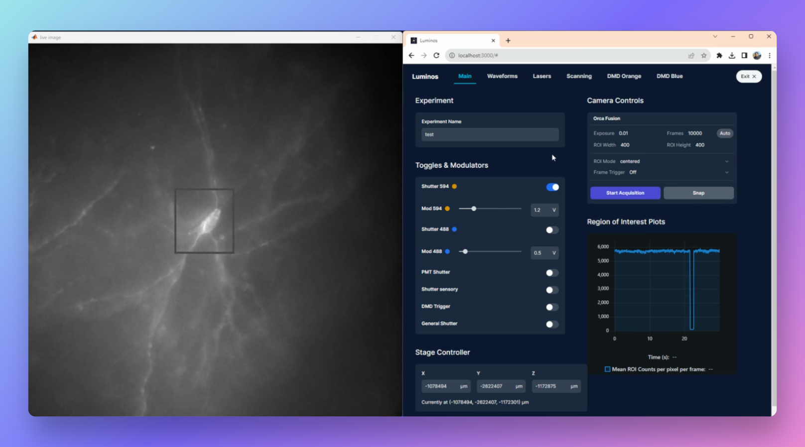

# Luminos: Bi-directional microscopy software

Luminos is a MATLAB library for **bi-directional microscopy**: simultaneous high-speed imaging and patterned optical stimulation.

## Documentation

You can find the Luminos documentation [on the website](https://luminosmicroscopy.com). Check out the [Getting Started](https://www.luminosmicroscopy.com/getting-started) page to get set up.
