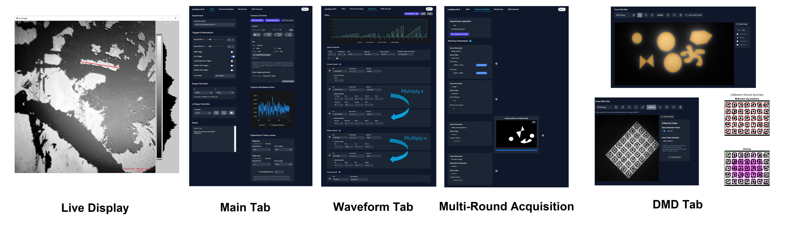

Luminos is a MATLAB library for **bi-directional microscopy**: simultaneous high-speed imaging and patterned optical stimulation.

## Documentation

You can find the Luminos documentation [on the website](https://luminosmicroscopy.com). Check out the [Getting Started](https://www.luminosmicroscopy.com/getting-started) page to get set up.

# New features in v0.4 (Updated 2/14/25):

- Improved DMD calibration using AprilTags, select between different patterns and transforms
- Calibrations fully agnostic to ROI or Binning
- Rotate or Flip Camera FOV
- Camera ROI option centered with offset (define midpoint and height/width)
- Real time pixel brightness histogram and optional histogram equalization
- Multi-Round acquisition and meta-experiments (for Standard acquisition, Snaps, Waveform only, Hadamard or HiLo)
- Autofocus using motorized z-stage or xyz-stage
- Automated setup of z-stacks, multiwell plate acquisitions etc. in GUI, compatible with autosampler
- ROI brightness plotter support for multiple cameras
- Distance measurements in live stream and DMD circle drawing in pixels or absolute units (um,mm,cm)
- Button for aborting running acquisition
- Toggle for blanking screen during acquisition
- Flexible trigger setup using non-PFI DO, PFI-DO or CTR
- New User Manual on Luminos Website

# New features in v0.2 (Update 6/13/24):

- Support for Teledyne Kinetix camera
- Automated DMD calibration using AprilTags
- Support for Newport motor controller
- Acquisition triggerable by external TTL pulses
- Acquisition with cameras without clock output
- Digital confocal setup using Hadamard and HiLo
- Automated SLM Calibration
- Improved functionality of scanning devices
- Fixed lots of bugs
