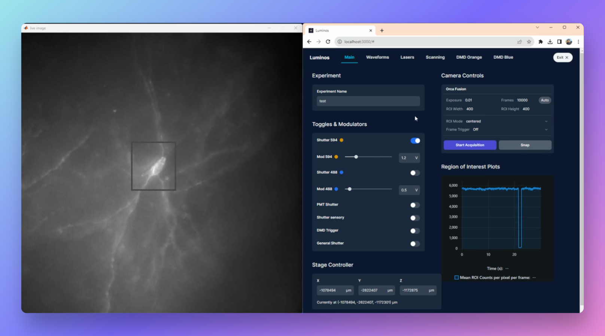
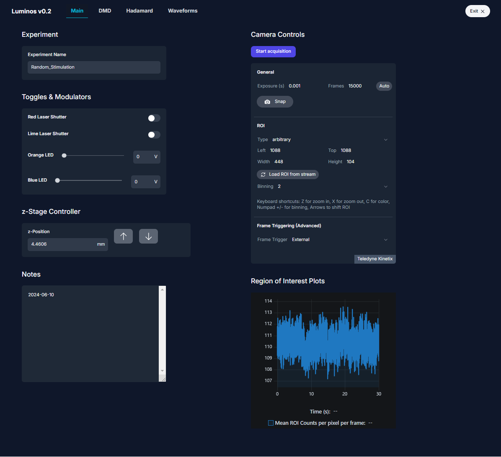

# Luminos: Bi-directional microscopy software 

Luminos is a MATLAB library for **bi-directional microscopy**: simultaneous high-speed imaging and patterned optical stimulation.

## Documentation

You can find the Luminos documentation [on the website](https://luminosmicroscopy.com). Check out the [Getting Started](https://www.luminosmicroscopy.com/getting-started) page to get set up.

# New features in v0.2 (Big Update 6/13/24):

Details on the new features and information on how to upgrade to follow soon...

- Support for Teledyne Kinetix camera 
- Automated DMD calibration using AprilTags
- Support for Newport motor controller 
- Acquisition triggerable by external TTL pulses
- Acquisition with cameras without clock output
- Digital confocal setup using Hadamard and HiLo 
- Automated SLM Calibration
- Improved functionality of scanning devices 
- Fixed lots of bugs :)

